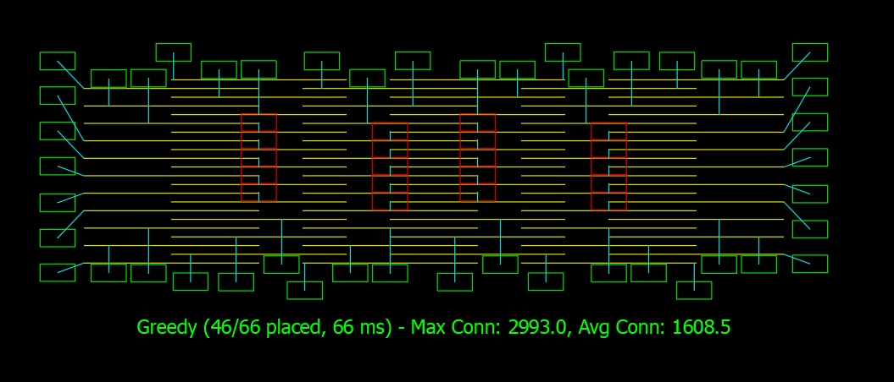
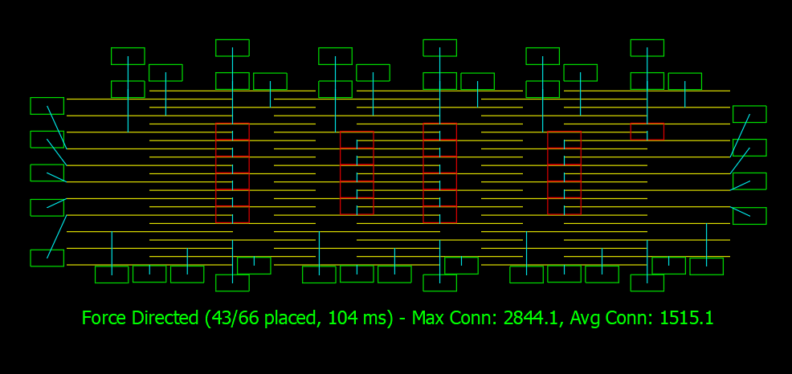
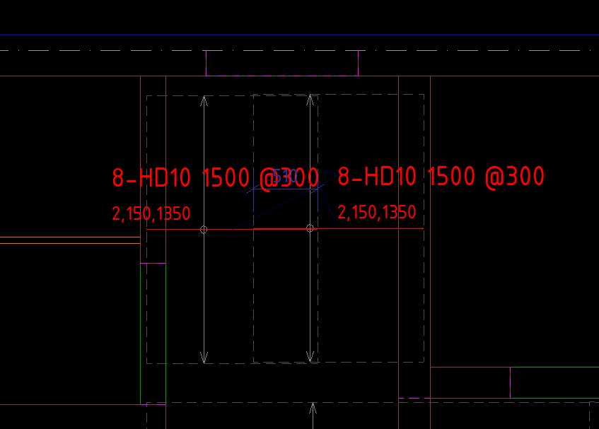
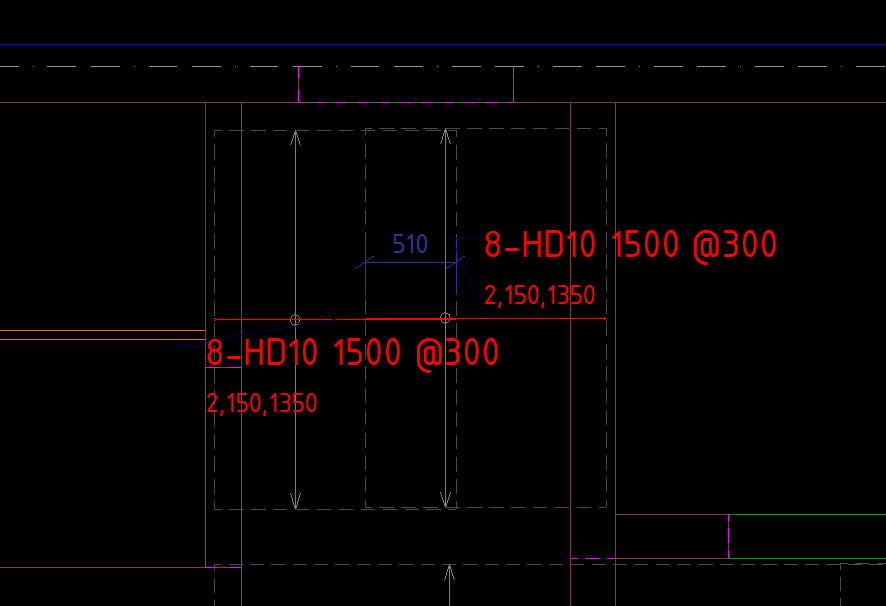
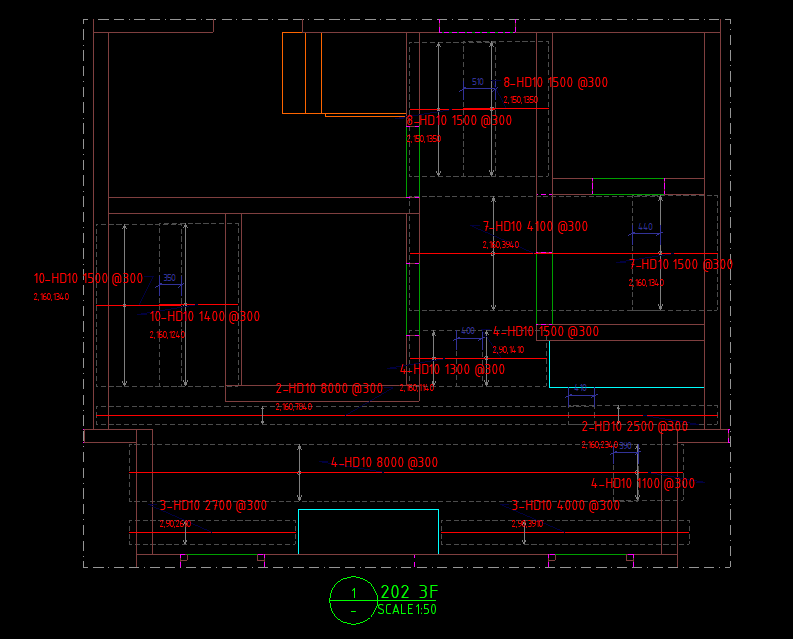

# ArrangeAlgorithms

[](https://www.nuget.org/packages/ArrangeAlgorithms/)
[](https://www.nuget.org/packages/ArrangeAlgorithms/)
[](LICENSE)

2D label placement library for engineering drawings: given a set of labels, each associated with a guide segment and surrounding blocked regions, the library calculates translation vectors to prevent labels from overlapping each other and encroaching on the blocked regions.

The library is pure geometry and does not depend on AutoCAD. The `ArrangeAlgorithms.CadTest` project is a plugin used for visual testing inside AutoCAD, kept separate.

## Installation

You can install the package directly from [NuGet.org](https://www.nuget.org/packages/ArrangeAlgorithms):

**Package Manager (.NET CLI):**
```bash
dotnet add package ArrangeAlgorithms
```

**Package Manager Console (Visual Studio):**
```powershell
NuGet\Install-Package ArrangeAlgorithms
```

**PackageReference (in `.csproj`):**
```xml
<PackageReference Include="ArrangeAlgorithms" Version="2.0.0" />
```

## Visual Examples

### AutoCAD Integration
Here are some examples of labels arranged inside AutoCAD to avoid overlaps and blocked regions:

| Greedy | Force Directed |
|:---:|:---:|
|  |  |

### Tekla Structures Integration
Here is an example of reinforcement marks before and after arrangement:

| Before Arrangement | After Arrangement |
|:---:|:---:|
|  |  |

| Arranged Marks Avoiding Dimension Obstacles |
|:---:|
|  |

## Structure

| Project | Role | Target |
|---|---|---|
| `ArrangeAlgorithms` | Core library: geometric types + 5 algorithms | netstandard2.0 |
| `ArrangeAlgorithms.UnitTest` | xUnit test suite | net48 |
| `ArrangeAlgorithms.CadTest` | AutoCAD 2021 plugin for visual testing | net48 |
| `ArrangeAlgorithms.TeklaTest` | Tekla Structures test program for rebar mark arrangement | net48 |

## Quick Start

```csharp
var leader = new GeoLine(0.0, 0.0, 2000.0, 0.0);

var arranges = new List<Arrange>
{
    new Arrange
    {
        // Label bounding box: center, width, height, rotation angle (radians, counter-clockwise)
        GeoRectangle = new GeoRectangle(new GeoPoint(1000.0, 0.0), 2000.0, 1000.0),
        // Guide segment: its midpoint is the origin for candidate positions expansion
        GeoLine      = leader,
        // Minimum perpendicular offset between label edge and guide segment, specific to this label (default 50)
        MarkOffsetFromLine = 50.0,
        // Blocked regions the label must not overlap
        BlockPolygons = new List<GeoPolygon>(),
        BlockLines    = new List<GeoLine>()
    }
};

// Returns translation vector for each label, in the exact input order.
// Each Arrange object is also automatically updated: arranges[i].TranslationVector contains the same vector.
List<GeoVector> moves = Arrange.Run(arranges);

for (int i = 0; i < arranges.Count; i++)
{
    // You can use the returned 'moves[i]' or read the property directly:
    GeoVector move = arranges[i].TranslationVector; 
    
    GeoPoint newPosition = arranges[i].GeoRectangle.Center + move;
    bool isPlaced = arranges[i].Placed; // false = forced to fallback, still has overlap
}
```

To change the algorithm or fine-tune parameters, pass `ArrangeOptions`:

```csharp
var options = new ArrangeOptions
{
    Algorithm           = ArrangeAlgorithmType.BoundedBacktracking,
    RowGap              = 20.0,
    PerpendicularLevels = 3
};

List<GeoVector> moves = Arrange.Run(arranges, options);
```

`ArrangeOptions` is the shared configuration for the entire list. `MarkOffsetFromLine` is set per `Arrange` because each label may require a different offset:

```csharp
var smallTextLabel = new Arrange
{
    GeoRectangle = new GeoRectangle(new GeoPoint(1000.0, 0.0), 2000.0, 1000.0),
    GeoLine      = leader,
    MarkOffsetFromLine = 50.0   // small text, closely sticks to guide segment
};

var largeTextLabel = new Arrange
{
    GeoRectangle = new GeoRectangle(new GeoPoint(1000.0, 0.0), 4000.0, 2000.0),
    GeoLine      = leader,
    MarkOffsetFromLine = 200.0  // large text, must move further away
};

List<GeoVector> moves = Arrange.Run(new List<Arrange> { smallTextLabel, largeTextLabel }, options);
```

## Candidate Positions Generation

All 5 algorithms share the same set of discrete candidate positions, expanding from the midpoint of the guide segment:

- **Perpendicular Translation** — each level in `PerpendicularLevels` creates a row of labels, symmetric on both sides of the guide segment. The first level is placed at half the label height plus the label's own `MarkOffsetFromLine`. Each subsequent level adds the label height plus `RowGap`.
- **Longitudinal Sliding** — in each row, the label slides parallel to the guide segment in both directions, up to a maximum of half the guide segment length plus `LongitudinalOvershootRatio` times the label width.

The algorithms only differ in how they **select** from this candidate set.

## Five Algorithms

| `ArrangeAlgorithmType` | Selection Strategy | Trade-off |
|---|---|---|
| `Greedy` (default) | Sequentially places labels, prioritizing the most constrained ones; selects the most open spot in the first group of free candidates | Fastest, reproducible results, but prone to local optima |
| `BoundedBacktracking` | Same as Greedy, but backtracks when subsequent labels are stuck, bounded by `MaxBacktrackSteps` | Higher clean placement rate, slower on crowded drawings |
| `SimulatedAnnealing` | Global optimization based on a collision-penalty energy function, gradually cooling down | Best for extremely crowded drawings, CPU-heavy |
| `ForceDirected` | Simulates spring and repulsive forces, then maps to the nearest discrete candidate | Distributes labels evenly and naturally |
| `ConstraintSatisfaction` | CSP with MRV heuristic and forward checking | Most rigorous, potential combinatorial explosion with large number of labels |

`BoundedBacktracking` and `ConstraintSatisfaction` automatically fallback to `Greedy` if no collision-free solution is found, ensuring every label always has a display position.

`SimulatedAnnealing` uses a fixed seed, so its results are reproducible between runs.

## Parameters for each `Arrange`

| Parameter | Default | Meaning |
|---|---|---|
| `GeoRectangle` | — | Label bounding box, the geometry that will be translated |
| `GeoLine` | — | Guide segment; its midpoint is the origin for candidate positions expansion |
| `MarkOffsetFromLine` | 50.0 | Minimum perpendicular offset between label edge and guide segment |
| `BlockPolygons` | — | Blocked polygons that the label must not overlap |
| `BlockLines` | — | Blocked line segments that the label must not overlap |

## Main Parameters of `ArrangeOptions`

| Parameter | Default | Meaning |
|---|---|---|
| `Algorithm` | `Greedy` | Algorithm to use |
| `RowGap` | 20.0 | Clearance between two consecutive rows of labels |
| `PerpendicularLevels` | 3 | Number of perpendicular fallback levels to test on each side |
| `LongitudinalOvershootRatio` | 0.75 | Ratio of label width allowed to overshoot beyond the two endpoints of the guide segment |
| `MinimumBoxSize` | 10.0 | Labels smaller than this size are ignored |
| `MinimumMoveDistance` | 0.1 | Translations smaller than this threshold are rounded to zero |
| `NeighbourMargin` | 50.0 | Expanded margin when filtering nearby obstacles |
| `PlaceMostConstrainedFirst` | true | Place labels with fewer options first |
| `PlaceFromInsideOut` | true | Prioritize labels close to the area centroid |
| `LookAheadCandidates` | 3 | Number of free positions considered before selection |
| `MaxBacktrackSteps` | 1000 | Cap on the number of backtracking steps |
| `AnnealingInitialTemperature` | 100.0 | Initial temperature for the Simulated Annealing algorithm |
| `AnnealingCoolingRate` | 0.95 | Cooling rate for the Simulated Annealing algorithm |
| `ForceIterations` | 100 | Number of force simulation iterations for the Force-Directed algorithm |
| `Tolerance` | `Tolerance.Global` | Tolerance for geometric comparisons |

Default values are in millimeters, matching conventional structural drawings.

## Geometric Types

`GeoPoint`, `GeoVector`, `GeoLine`, `GeoCircle`, `GeoRectangle` (rotated rectangle — OBB), `GeoPolygon`, `GeoPolyline`.

### Regions and curves

The shapes split into two families, and the distinction decides what you can ask of them:

| Family | Types | Encloses an area |
|---|---|---|
| Region | `GeoCircle`, `GeoRectangle`, `GeoPolygon` | yes |
| Curve | `GeoLine`, `GeoPolyline` | no |

A `GeoPolyline` is always an open chain — it has no `IsClosed` flag and never joins its last vertex back to its first. Geometry meant to enclose something is a `GeoPolygon`, and `polyline.ToPolygon()` converts between them.

That rule is what decides the answers below. A chain of vertices tracing a square still holds only the points on its path:

```csharp
var traced = new GeoPolyline(
    new GeoPoint(0, 0), new GeoPoint(10, 0),
    new GeoPoint(10, 10), new GeoPoint(0, 10), new GeoPoint(0, 0));

traced.Locate(new GeoPoint(5, 5));            // OutSide  — a curve has no interior
traced.DistanceTo(new GeoPoint(5, 5));        // 5.0      — measured to the path
traced.ToPolygon().Locate(new GeoPoint(5, 5)); // Inside  — now it is a region
traced.ToPolygon().DistanceTo(new GeoPoint(5, 5)); // 0.0
```

Only regions offer `Contains`; every shape offers `Locate`, and curves report `OnSide` or `OutSide`.

### Collision and intersection

`CollidesWith` answers whether two shapes overlap, `GetIntersections` returns the crossing points. Every pair is available from both directions, and each has an overload taking an explicit `Tolerance`:

```csharp
rect.CollidesWith(line);        line.CollidesWith(rect);
rect.CollidesWith(poly);        poly.CollidesWith(rect);
circle.CollidesWith(polyline);  polyline.CollidesWith(circle);
rect.CollidesWith(otherRect);   poly.CollidesWith(otherPoly);   line.CollidesWith(otherLine);

GeoPoint[] points = poly.GetIntersections(line);
```

### Splitting

`Splition` cuts a `GeoLine` or a `GeoPolyline` — at a position along it, or wherever a cutter meets it. Pieces come back in order along the subject, so the first piece always holds its start point and the last holds its end point.

Cutting at a position:

```csharp
Splition.TrySplitBy(line, point, out GeoLine first, out GeoLine second);
Splition.TrySplitAtDistance(polyline, 12.5, out GeoPolyline head, out GeoPolyline tail);

GeoLine[] pieces = Splition.SplitAtDistances(line, new[] { 2.0, 5.0, 8.0 });
```

Cutting with another shape. A single cutter that can only meet a segment once fills two pieces; anything that can meet it repeatedly fills an array:

```csharp
Splition.TrySplitBy(line, cutter, out GeoLine first, out GeoLine second);
Splition.TrySplitBy(polyline, cutter, out GeoPolyline[] pieces);

// Several cutters at once, and points already known to lie on the subject.
Splition.TrySplitBy(line, new[] { cutterA, cutterB }, out GeoLine[] byLines);
Splition.TrySplitBy(polyline, new[] { new GeoPoint(3, 0) }, out GeoPolyline[] byPoints);
```

Splitting against a `GeoPolygon` sorts the result by which side of the boundary each part falls on, and keeps each run whole rather than breaking it into segments:

```csharp
Splition.TrySplitBy(line,     polygon, out GeoLine[] inside,     out GeoLine[] outside);
Splition.TrySplitBy(polyline, polygon, out GeoPolyline[] insideRuns, out GeoPolyline[] outsideRuns);

// Several polygons behave as their union.
Splition.TrySplitBy(polyline, new[] { polygonA, polygonB }, out GeoPolyline[] within, out GeoPolyline[] beyond);
```

Every split is also reachable from the shape being cut, which is usually how it reads better:

```csharp
line.TrySplitBy(point, out GeoLine first, out GeoLine second);
line.TrySplitAtDistance(4.0, out first, out second);
line.TrySplitBy(polygon, out GeoLine[] inside, out GeoLine[] outside);
GeoLine[] pieces = line.SplitAtDistances(new[] { 2.0, 5.0, 8.0 });

polyline.TrySplitBy(cutter, out GeoPolyline[] parts);
polyline.TrySplitBy(polygon, out GeoPolyline[] insideRuns, out GeoPolyline[] outsideRuns);
```

The instance methods live on the shape being cut, not on the cutter: `polygon.Split(line)` would leave it unclear which of the two comes back in pieces.

**What the return value means.** `false` says nothing was cut, not that the call failed. The out parameters are always usable: an array form hands back the subject as a single piece, and a polygon form puts it in whichever of the two arrays matches the side it lies on, leaving the other empty.

**What gets skipped.** Cut positions outside the subject, or landing on one of its endpoints, are not splits. Positions closer together than the tolerance merge into one, and a position within a tolerance of an existing vertex snaps onto it, so no piece and no edge is ever shorter than the tolerance. A point that does not lie on the subject is refused rather than projected onto it — cutting at its projection would be cutting somewhere nobody asked for.

**Against a polygon.** A part running along the boundary counts as inside, matching `Contains`. A path that merely touches the boundary and turns back has not crossed it, so it comes back whole instead of split in two at the touch.

### Tolerance

`Tolerance.Global` is the tolerance applied to overloads that do not pass a custom tolerance. It has a static setter, intentionally designed to mimic `Autodesk.AutoCAD.Geometry.Tolerance.Global`; changing it affects the entire application, so it should only be set once at startup.

## Build and Test

```bash
dotnet build ArrangeAlgorithms/ArrangeAlgorithms.csproj
dotnet test  ArrangeAlgorithms.UnitTest/ArrangeAlgorithms.UnitTest.csproj
```

## Running inside AutoCAD

`ArrangeAlgorithms.CadTest` builds a DLL file to be loaded into AutoCAD:

```bash
dotnet build ArrangeAlgorithms.CadTest/ArrangeAlgorithms.CadTest.csproj
```

The output is located at `ArrangeAlgorithms.CadTest/bin/Debug/net48/ArrangeAlgorithms.CadTest.dll`. Load this file into AutoCAD using the `NETLOAD` command, then run one of the following commands: `T1_Greedy`, `T1_BoundedBacktracking`, `T1_SimulatedAnnealing`, `T1_ForceDirected`, `T1_ConstraintSatisfaction`. Select LINE or LWPOLYLINE objects, and the plugin will draw the label box before and after arrangement, along with statistics.

The project references three DLLs: `accoremgd`, `acdbmgd`, `acmgd` via the `AutoCadPath` declared in the `.csproj` file. If those DLLs are located elsewhere on your machine, edit the `AutoCadPath` line.

## Running inside Tekla Structures

`ArrangeAlgorithms.TeklaTest` is a console application that connects to the active Tekla Structures model and drawing to arrange reinforcement marks.

To build and run:
1. Open Tekla Structures and open a drawing with some reinforcement marks and dimensions selected.
2. Build the project:
   ```bash
   dotnet build ArrangeAlgorithms.TeklaTest/ArrangeAlgorithms.TeklaTest.csproj
   ```
3. Run the compiled executable:
   ```bash
   ArrangeAlgorithms.TeklaTest/bin/Debug/net48/ArrangeAlgorithms.TeklaTest.exe
   ```
